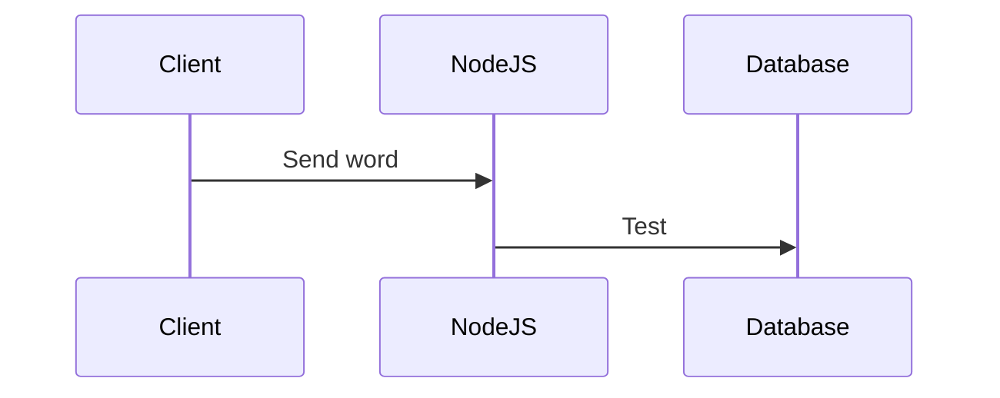

# BOUCHECOUSUE
**BOUCHECOUSUE** is a [sutom]()-like game. Guess the daily word by knowing it first letter and it number of letters. Be carefull, you only have 6 tries.

## SETUP
- To setup this project
- Depuis la racine du projet:

`sudo sh reload-images.sh`

# Tests

