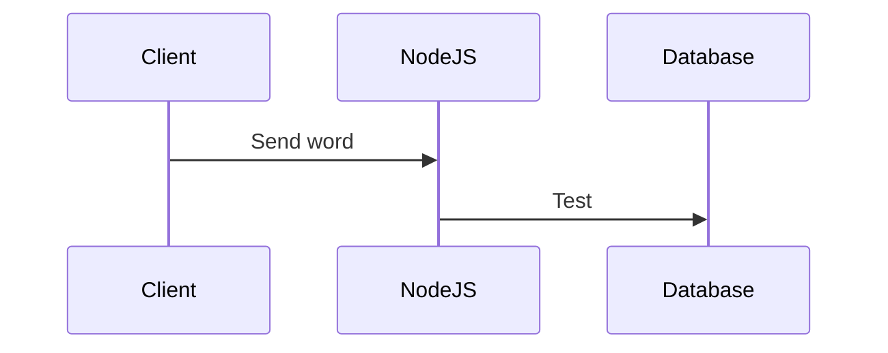

# BOUCHECOUSUE
**BOUCHECOUSUE** is a [sutom]()-like game. Guess the daily word by knowing it first letter and it number of letters. Be carefull, you only have 6 tries.

    

## SETUP
- Requierements:
    - [docker](https://docs.docker.com/engine/install/)
    - [docker-compose](https://docs.docker.com/compose/install/)
    - [npm](https://www.npmjs.com/)
- Download this GitHub repository code
- Run the setup script: `sudo sh setup.sh`. This script will:
    - update npm
    - install dependencies
    - build images

## RUN & MAINTAIN
- To run the app:
    - Run docker containers using docker-compose: `sudo docker-compose up`
    - Launch any web browser and go to: `localhost:3000`
- If you updated the program, you shall update all images with: `sudo docker-compose build`

## TECHNICAL DOCUMENTATION

