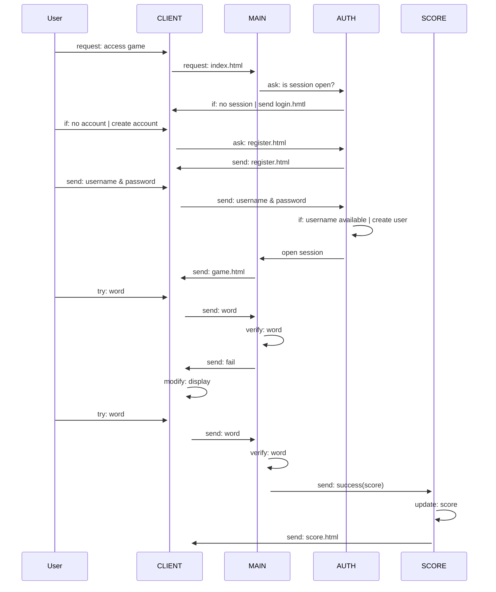

# BOUCHECOUSUE
**BOUCHECOUSUE** is a [sutom]()-like game. Guess the daily word by knowing it first letter and it number of letters. Be carefull, you only have 6 tries.

    

## SETUP
- Requierements:
    - [docker](https://docs.docker.com/engine/install/)
    - [docker-compose](https://docs.docker.com/compose/install/)
    - [npm](https://www.npmjs.com/)
- Download this GitHub repository code
- Run image build and containers creation: `sudo docker-compose up`

## RUN & MAINTAIN
- To run the app:
    - Run docker containers using docker-compose: `sudo docker-compose up`
    - Launch any web browser and go to: `localhost:3000`
- If you updated the program, you shall update all images with: `sudo docker-compose build`

## TECHNICAL DOCUMENTATION
### Project state
**BOUCHECOUSUE** run three different servers to function:
- **main**: manages the game.
- **score**: manages the score database and related computation.
- **auth**: manages authentication database and related computation.

### Sequence diagram

### ToDo
Some ideas have not been implemented and the project contain some known security breaches.

#### Features
Please find below an exhaustive list of the features not implemented for the moment.
- Add a reverse proxy with haproxy.
- oAuth2/OpenID.
- Monitor logs & metrics.
- Use a SQL database.
- Deploy the app in the NAS we own.

#### Security breaches
Please find below the security breaches we have indentified. We might have not identified all breaches, fell free to contact us if you find one.
- Passwords are stored as raw text in a json file in the **auth** server.
- The session can be modified from the client.
- Not protected against JS injections.
- Requests status is not checked.

## USEFUL TOOLS
Here's a list of the usefull tools we used to develop this projet:
- [Git](https://git-scm.com/) & [Github](https://github.com/): versioning & collaboration
- [Notion](https://www.notion.so): project progress & collaboration
- [Mermaid](https://mermaid.live): fast and Github-markdown-compatible diagrams editor

## LICENSE
This project is licensed under the **BSD 3-Clause License**. Feel free to edit and distribute this app as you like.
See [LICENSE](https://github.com/alexisjapas/boucheCousue/blob/main/LICENSE) for more information.
