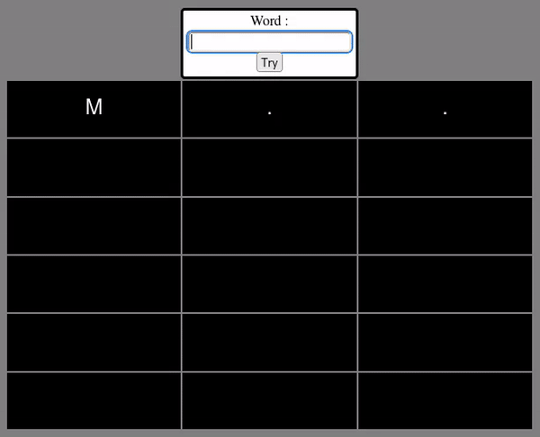
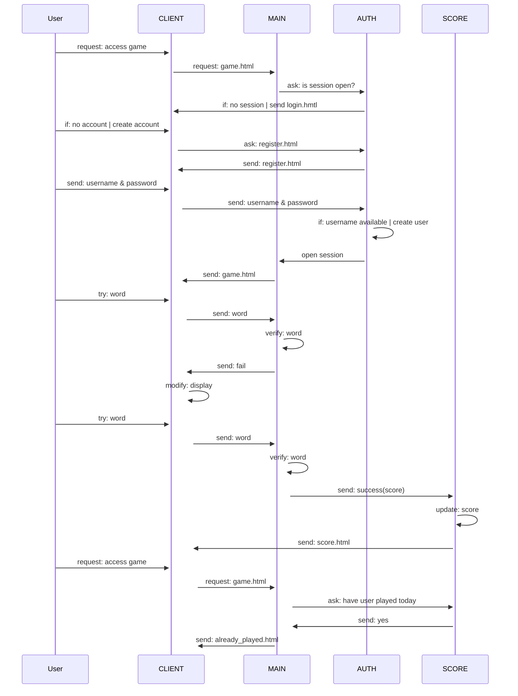

# BOUCHECOUSUE
**BOUCHECOUSUE** is a [sutom]()-like game. Guess the daily word by knowing it first letter and it number of letters. Be carefull, you only have **5 tries**.

    

## SETUP
- Requierements:
    - [docker](https://docs.docker.com/engine/install/)
    - [docker-compose](https://docs.docker.com/compose/install/)
    - [npm](https://www.npmjs.com/)
- Download this GitHub repository code
- Run image build and containers creation: `sudo docker-compose up`

## RUN & MAINTAIN
- To run the app:
    - Run docker containers using docker-compose: `sudo docker-compose up`
    - Launch any web browser and go to: `localhost:3000`
- If you updated the program, you shall update all images with: `sudo docker-compose build`

## TECHNICAL DOCUMENTATION
### Project state
#### The game
The game page is composed of two sections: an *input field* and a *table* displaying letters sent by the user and their state (green: the letter exists and is well placed, orange: the letter exists and is badly placed, red: the letter does not exists). If a letter has more occurances in the user's try than in the target word, only the number of occurances in the target word will be colored as green and/or orange.
The user cannot send a word with a different size than the target word. The user cannot send a word that not exists in our dictionary.
The user has **five** tries to win.
The user can only play once a day.

#### Score
The score is displayed as a table containing: its user name, its average number of tries (only when victories), its number of games played and its win/lose ratio.

#### Project tree
**BOUCHECOUSUE** run three different *nodejs* servers using *express* to define our APIs:
- **main**: manages the game.
- **score**: manages the score database and related computation.
- **auth**: manages authentication database and related computation.

#### HTML
The main server generate the index.html which is subdivided in three bricks: *header*, *core*, *footer*.
*header* buttons are enabled only if a user is connected. They enable to navigate between **score** and **game**. A button enable the user to logout. 
Only the *core* brick changes depending of the differents **HTML** bricks sent by the servers.
The *footer* does not play football.

#### JavaScript
Each HTML page own its JS controller which define all events that will affect the page. We used *jQuery* and *AJAX*.

#### Database
Databases are *JSON* files. The score and authentication databases are separated in related servers.

#### Deployment
We used *Docker* to deploy our app. Each server has its container.
To construct the images, Dockerfiles have been written. A docker-compose.yml enable us to build and run all containers at once.
All images are based on the [node](https://hub.docker.com/_/node) image.

### Sequence diagram
This diagram assume the user has no account. He will create one and win the game in two tries.

### ToDo
Some ideas have not been implemented and the project contain some known security breaches.

#### Features
Please find below an exhaustive list of the features not implemented for the moment.
- Add a reverse proxy with haproxy.
- oAuth2/OpenID.
- Monitor logs & metrics.
- Use a SQL database.
- Deploy the app in the NAS we own.
- Add a function to reset the already_played variable for all users at midnight each day.

#### Security breaches
Please find below the security breaches we have indentified. We might have not identified all breaches, fell free to contact us if you find one.
- Passwords are stored as raw text in a json file in the **auth** server.
- The session can be modified from the client.
- Not protected against JS injections.
- Requests status is not checked.

## USEFUL TOOLS
Here's a list of the usefull tools we used to develop this projet:
- [Git](https://git-scm.com/) & [Github](https://github.com/): versioning & collaboration
- [Notion](https://www.notion.so): project progress & collaboration
- [Mermaid](https://mermaid.live): fast and Github-markdown-compatible diagrams editor

## LICENSE
This project is licensed under the **BSD 3-Clause License**. Feel free to edit and distribute this app as you like.
See [LICENSE](https://github.com/alexisjapas/boucheCousue/blob/main/LICENSE) for more information.
